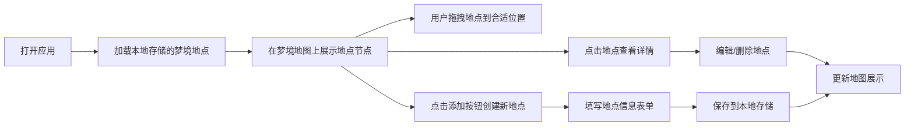

# 梦境地点地图 - 产品需求文档

## 1. 产品概述

"梦境地点地图"是一款私人梦境档案网页应用，帮助用户记录和可视化梦中反复出现的地点。用户可以在一张可拖拽的虚拟梦境地图上布置各个梦境地点，记录每个地点的名称、氛围、出现频率、相关人物、记忆片段和情绪颜色。所有数据保存在浏览器本地，打造私密、梦幻的个人梦境档案馆。

## 2. 核心功能

### 2.1 功能模块

1. **梦境地图首页**：可拖拽的虚拟梦境地图，展示所有梦境地点节点
2. **地点详情面板**：查看和编辑单个梦境地点的详细信息
3. **地点管理**：添加、编辑、删除梦境地点
4. **本地数据存储**：所有数据保存在浏览器 localStorage
5. **情绪色彩系统**：每个地点用独特的情绪颜色可视化

### 2.2 页面详情

| 页面名称 | 模块名称 | 功能描述 |
|---------|---------|---------|
| 梦境地图首页 | 地图画布 | 展示所有梦境地点节点，支持拖拽定位 |
| 梦境地图首页 | 顶部标题区 | 应用标题、添加地点按钮、统计信息 |
| 地点详情面板 | 地点信息展示 | 展示地点名称、氛围、频率、人物、记忆片段 |
| 地点详情面板 | 情绪颜色 | 展示和编辑情绪颜色 |
| 添加/编辑地点 | 表单 | 填写地点各项信息 |
| 侧边栏/档案目录 | 地点列表 | 以档案目录形式展示所有地点列表 |

## 3. 核心流程

## 4. 用户界面设计

### 4.1 设计风格

- **主色调**：深邃暗夜紫蓝渐变背景，营造梦幻夜晚氛围
- **辅助色**：各地点使用用户自定义的情绪颜色，作为节点的主色调
- **整体风格**：神秘、私密档案风格，类似古老的梦境档案卷宗
- **字体**：衬线字体为主，搭配手写风格字体点缀
- **节点样式**：地点节点采用发光效果，带柔和光晕
- **背景**：星空/星云纹理，微弱的粒子漂浮效果
- **质感**：半透明玻璃拟态（Glassmorphism）面板，纸质纹理

### 4.2 页面设计概述

| 页面名称 | 模块名称 | UI 元素 |
|---------|---------|---------|
| 梦境地图首页 | 地图画布 | 深空背景带星点纹理、可拖拽节点、连接线（可选）、发光节点带光晕效果 |
| 梦境地图首页 | 顶部标题区 | 衬线大标题、副标题描述、添加地点按钮、地点计数 |
| 地点详情面板 | 面板设计 | 玻璃拟态侧边面板、滚动区域、情绪颜色色块、关闭按钮 |
| 添加/编辑表单 | 表单设计 | 优雅的输入框、文本域、颜色选择器、保存取消按钮 |
| 档案目录侧边栏 | 目录列表 | 手风琴式档案夹风格、小情绪色点、地点名称列表 |

### 4.3 响应式

- 桌面端：左右布局，地图为主区域 + 侧边详情面板
- 移动端：上下布局，地图在上，详情面板从底部滑入
- 触摸设备：支持触摸拖拽操作

### 4.4 动效与交互

- 页面加载时，地点节点渐次浮现动画
- 节点拖拽时有轻微呼吸动效
- 详情面板滑入滑出过渡
- 悬停时节点光晕增强
- 保存成功后的微反馈动效
