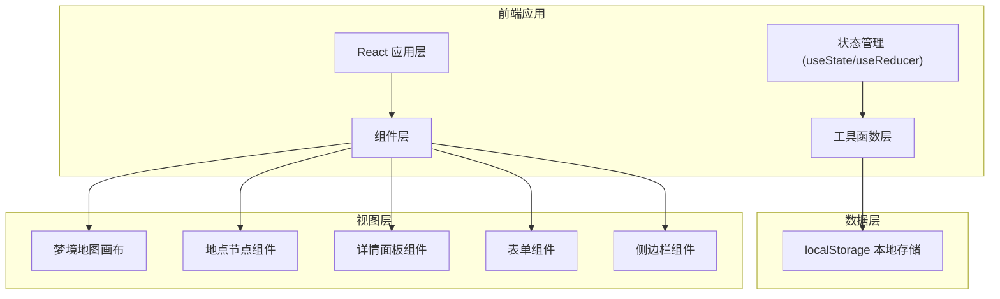
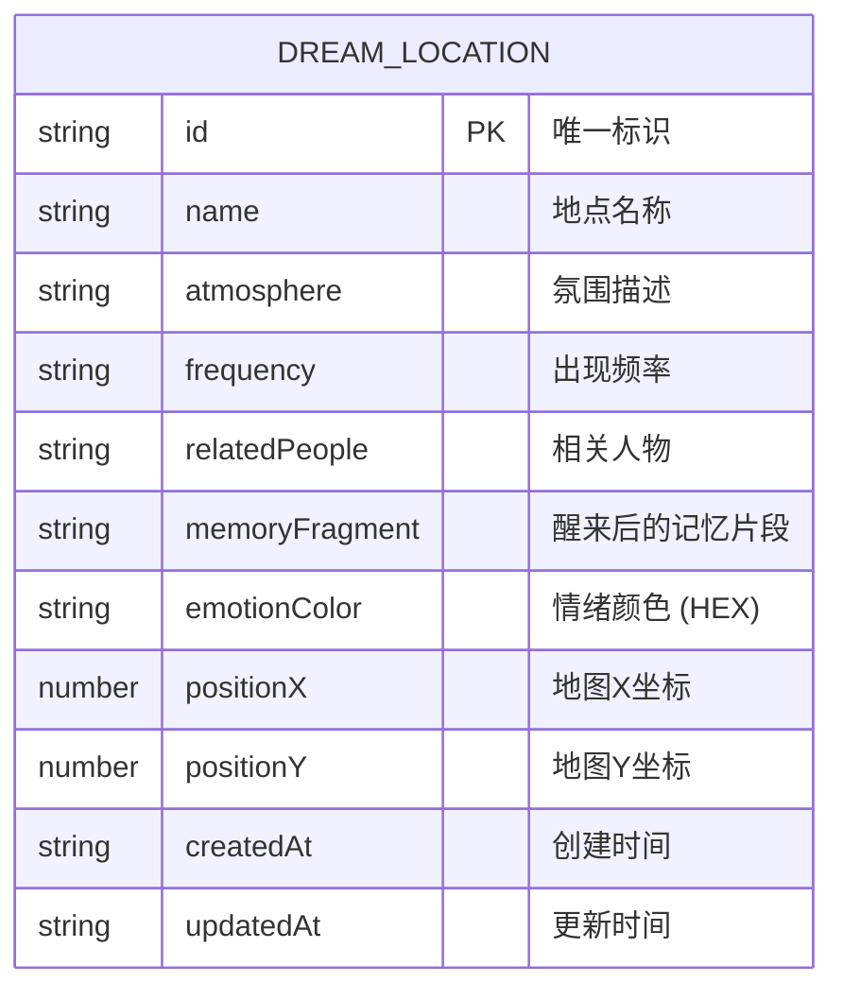

# 梦境地点地图 - 技术架构文档

## 1. 架构设计



## 2. 技术描述

- **前端框架**：React@18 + TypeScript
- **构建工具**：Vite
- **样式方案**：TailwindCSS 3 + 自定义 CSS
- **拖拽实现**：原生 HTML5 拖拽 API / 自定义拖拽逻辑
- **数据存储**：浏览器 localStorage
- **字体**：Google Fonts (Cinzel + Lora + Caveat)

## 3. 目录结构

```
src/
├── components/
│   ├── DreamMap/          # 梦境地图相关组件
│   │   ├── DreamMap.tsx   # 地图画布
│   │   └── DreamNode.tsx  # 地点节点
│   ├── DetailPanel/       # 详情面板
│   │   └── DetailPanel.tsx
│   ├── Form/              # 表单组件
│   │   └── LocationForm.tsx
│   ├── Sidebar/           # 侧边栏档案目录
│   │   └── Sidebar.tsx
│   └── Header/            # 顶部标题区
│       └── Header.tsx
├── hooks/
│   ├── useDreamLocations.ts  # 梦境地点数据管理 Hook
│   └── useLocalStorage.ts    # 本地存储 Hook
├── types/
│   └── index.ts           # TypeScript 类型定义
├── utils/
│   └── storage.ts         # 存储工具函数
├── App.tsx
├── main.tsx
└── index.css
```

## 4. 数据模型

### 4.1 数据模型定义



### 4.2 TypeScript 类型定义

```typescript
interface DreamLocation {
  id: string;
  name: string;
  atmosphere: string;
  frequency: string;
  relatedPeople: string;
  memoryFragment: string;
  emotionColor: string;
  positionX: number;
  positionY: number;
  createdAt: string;
  updatedAt: string;
}
```

### 4.3 localStorage 存储结构

```typescript
// Key: 'dream_locations'
// Value: DreamLocation[]
```

## 5. 核心功能实现思路

### 5.1 拖拽功能
- 地图容器使用 `relative` 定位
- 地点节点使用 `absolute` 定位
- 通过 `mousedown/mousemove/mouseup` 事件实现拖拽
- 支持触摸事件 `touchstart/touchmove/touchend`
- 拖拽结束后更新 `positionX` 和 `positionY` 并保存到 localStorage

### 5.2 数据持久化
- 自定义 `useLocalStorage` Hook
- 数据变更时自动同步到 localStorage
- 页面加载时从 localStorage 恢复数据

### 5.3 视觉效果
- CSS 渐变背景 + 星点纹理
- 节点使用 `box-shadow` 和 `filter: drop-shadow` 实现发光效果
- 玻璃拟态效果使用 `backdrop-filter: blur()`
- 动画使用 CSS `transition` 和 `@keyframes`
```